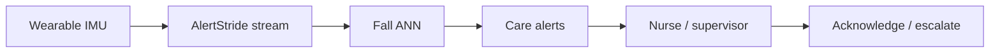

# AlertStride

**Source:** `ai-in-iot/1811.06672/`
**Domain:** `ai-iot`
**One-liner:** A streaming fall-detection service for retirement homes and rehab clinics that scores wearable accelerometer feeds in real time and notifies care staff when irregular activity patterns indicate a fall.
**Wedge:** Senior-living and rehab operators with high patient-to-nurse ratios where falls are reported late — or not at all — until injury is discovered.
**Positioning:** Irregular-pattern detection as a care ops product. The source frames falls as anomalies against regular activities (walk/sit), achieves 98.75% accuracy on MobiAct accelerometer data with an ANN, and describes a streaming deployment path (model → streaming analytics) for wearable health sensors in facilities.

## Market research synthesis

### Thesis from source

Streaming IoT analytics must distinguish regular from irregular patterns to drive automated notification and decision support. Falls are a high-stakes irregular human activity: an estimated 646,000 fatal falls annually (second leading cause of unintentional injury death after road traffic); highest death rates among adults over 60; >50% of injury-related hospitalizations in people over 65; nearly 40% of injury-related deaths in the elderly from falls. Canadian retirement and long-term care homes often have high patient-to-nurse ratios, so falls may go unreported until later — and hip fracture risk makes detection time critical.

The paper maps fall detection to irregular pattern learning on wearable accelerometer streams, validates an ANN at 98.75% accuracy on MobiAct (and references SisFall), and outlines an architecture that moves the trained model into a streaming analytics pipeline for real-time facility monitoring (e.g., Mbientlab-class wearables). The product wedge is not “generic HAR,” but care-operations notification with auditable model performance on published fall datasets and live streams.

### Buyer & economic model

- **Primary buyer:** COO / Director of Nursing at retirement homes, LTC, and rehab clinics; secondary: remote patient monitoring vendors.
- **Users:** floor nurses, night supervisors, clinical risk managers, biomedical/IT for wearables, compliance officers.
- **Budget owner / value metric:** clinical risk and staffing budget. Value metrics: median minutes-to-alert after fall, false alarm rate per resident-night, unreported fall rate, hospitalization after unwitnessed fall.
- **Competing status quo:** pendant buttons (require consciousness), camera-only systems (privacy backlash), offline HAR apps without care workflow, nurse rounds alone.

### Domain constraints

- **Regulatory / trust / safety:** medical device and care-home incident reporting regimes; alerts are clinical workflow artifacts; liability if false negatives.
- **Data sensitivity:** continuous motion of vulnerable adults; cameras often unacceptable — wearables preferred but still PHI-adjacent.
- **Change-management realities:** residents remove wearables; night staff alarm fatigue; models must separate fall classes from sitting/lying deliberately.

## Business requirements

- BR-1: Streaming accelerometer (and optional gyro) ingest must produce fall/no-fall decisions continuously with operator-visible latency SLOs.
- BR-2: Alert delivery to on-duty care roles must include resident identity, device ID, timestamp, and confidence, and must page the current shift roster.
- BR-3: False-alarm rate and miss rate must be reportable per facility and model version against labeled evaluation sets (e.g., MobiAct/SisFall-style holdouts and on-site reviews).
- BR-4: Residents or guardians must consent to continuous motion monitoring with purpose limited to safety alerting.
- BR-5: Staff must acknowledge or escalate alerts; unacknowledged alerts escalate by policy.
- BR-6: Wearable offline / not-worn detection must create a separate workflow so silent devices are not mistaken for “no falls.”
- BR-7: Model updates require clinical risk sign-off before production cutover.
- BR-8: Audit exports must support incident investigation and regulator review.
- BR-9: Camera video must not be required for core detection (wearable-first).
- BR-10: Commercial packaging prices by monitored residents and alert volume tiers.
- BR-11: Distinct fall scenarios (forward, lateral, etc. as labeled in training data) may be reported when model supports them, without delaying the primary fall flag.
- BR-12: Night-mode policies must allow sensitivity tuning to reduce alarm fatigue without silent failure on high-risk residents.

## User stories

Canonical user stories live in sibling [USER_STORIES.md](USER_STORIES.md).

## System design

### Overview

AlertStride enrolls residents and wearables, streams motion features into a fall-detection model, emits care alerts with acknowledgment/escalation, monitors device wear/health, and governs model versions with clinical sign-off and audit exports.

### Actors & boundaries

- **Actors:** resident, family/guardian, nurse, supervisor, risk manager, biomedical, compliance, operator.
- **Trust boundary:** motion and identity data stay in the care organization’s tenancy; vendors see operational telemetry only under BAA/contract.
- **Human-in-the-loop points:** consent; alert acknowledgment; sensitivity policy; model promotion sign-off; pause monitoring.

### Core capabilities

1. **Resident and device enrollment** — consent, wearable binding, wing/roster.
2. **Stream ingest** — accelerometer (optional gyro) frames.
3. **Fall inference** — irregular pattern scoring vs ADL baseline.
4. **Alerting and escalation** — shift roster, ACK, escalate.
5. **Device health / not-worn detection**
6. **Model governance** — evaluation metrics, clinical approve, rollback.
7. **Incident audit export**
8. **Privacy and retention controls**

### Conceptual data

- **Primary entities:** Facility, Resident, WearableDevice, MotionFrame, FallInference, CareAlert, Acknowledgement, ModelVersion, ConsentRecord, IncidentExport.
- **Critical events:** fall suspected, alert ACKed, escalated, device not worn, consent withdrawn, model approved.
- **Retention / audit needs:** alerts and ACKs retained for incident/legal windows; raw motion shorter unless locked to an incident.

### Integrations (conceptual)

- **Systems of record:** EHR/care management, nurse call systems, staffing/roster tools, wearable vendor clouds.
- **Upstream signals:** wearable IMU streams, optional bed/chair sensors as corroboration.
- **Downstream actions:** push/SMS/pager, nurse-call triggers, incident tickets.

### High-level architecture

### Success metrics

- **Leading:** stream uptime; wear compliance; median alert latency.
- **Lagging:** unwitnessed long-lie incidents; alert precision/recall; hospitalizations after unwitnessed falls.

## OpenAPI skeleton

Canonical HTTP surface lives in sibling `openapi.yaml`. Summarize here:

- **Base path:** `/v1/...`
- **Auth:** API key and/or Bearer JWT (operator)
- **Resource groups:** Residents, Devices, Streams, Inferences, Alerts, Models
