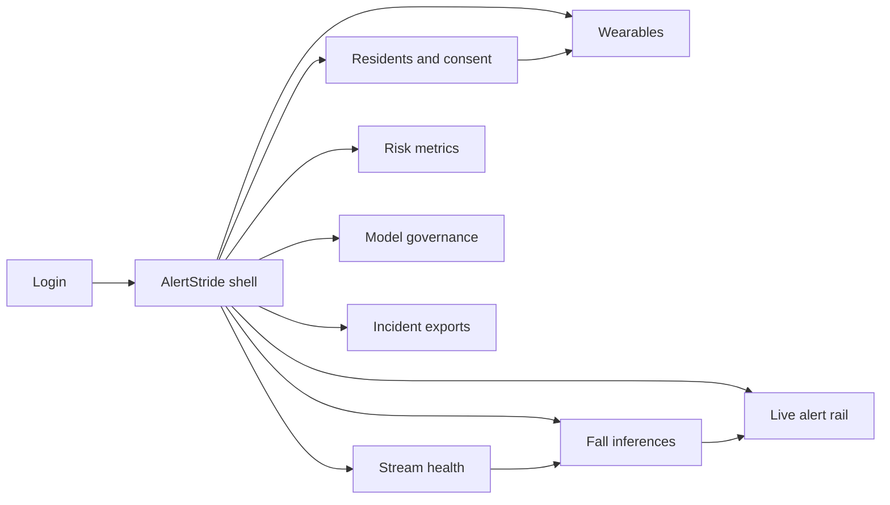
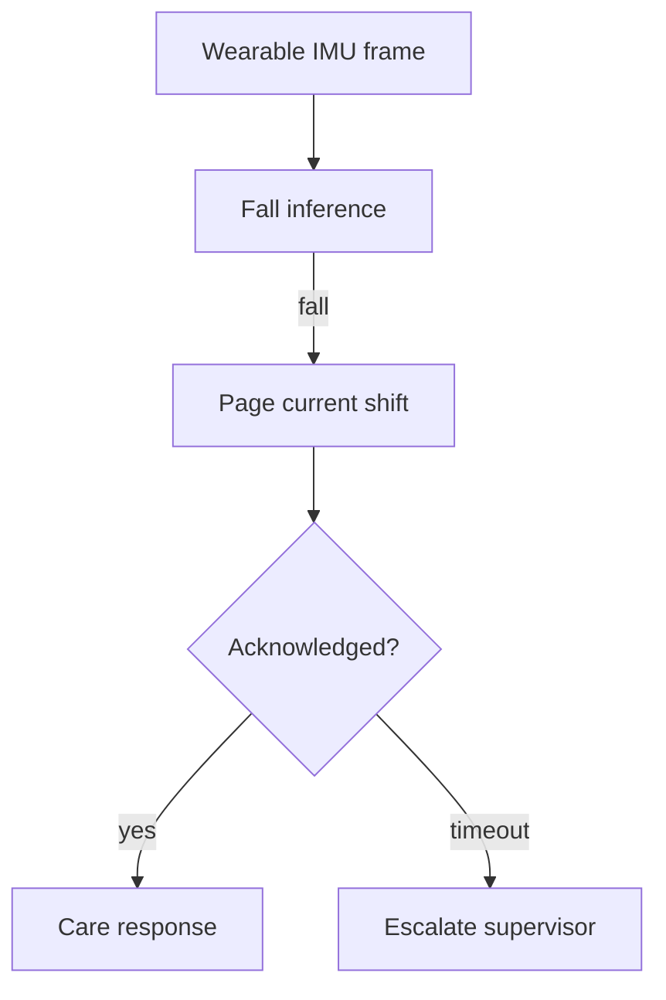

# AlertStride — Web app

**Product:** [PRODUCT.md](./PRODUCT.md)
**Primary surface:** Care-ops fall alert console (shift roster alerts + device wear health)
**Secondary surfaces:** Clinical risk metrics board (read-only); incident audit export viewer; resident/family consent portal
**Design thesis:** AlertStride is a care stride watch, not a fitness tracker — the UI metaphor is a night-floor alert rail where irregular motion becomes a pageable care event with ACK clocks, while “device not worn” is a different colour of silence than “no fall.” Visual language is calm clinical slate with care-coral alert pulses and soft sage for acknowledged on a quiet ward-ground: false alarms feel tunable, long-lie risk feels urgent, cameras are absent by design. The brand wordmark sits as a quiet care mark on every alert screen so nursing knows whose fall clock they are racing.

## UX research synthesis

### Category peers (best-in-class)

- **Philips Lifeline / medical alert ops:** Fall detection with caregiver notify and ACK. Steal: resident identity + timestamp + confidence on every page; reject pendant-only UX that assumes consciousness.
- **Nurse call / Rauland-class consoles:** Shift roster routing, escalate unacknowledged. Steal: current-shift page + escalate-by-policy; reject firehose without ACK ownership.
- **CarePredict / Essence Care@Home:** Wearable-first senior monitoring without cameras. Steal: wearable-first chrome and not-worn workflows; reject camera walls as core detection.
- **Epic Rover / PointClickCare mobile care:** Clinical acknowledgment patterns on the floor. Steal: thumb-friendly ACK/escalate; reject desktop-only alert UX for night staff.

### Patterns to adopt / reject

- **Adopt:** Streaming latency SLO visible; alert = resident + device + confidence + roster; ACK/escalate clocks; not-worn as separate workflow; clinical sign-off before model cutover; night-mode sensitivity without silent high-risk; wearable-first (no camera required); immutable incident timeline.
- **Reject:** Fitness dashboard as home; camera gallery; silent devices mistaken for safety; alarm spam without fatigue controls; purple “AI health” glow; lifestyle tracking framing in consent.

### Trust, density, and workflow constraints from PRODUCT.md

High patient-to-nurse ratios make minutes-to-alert the product (BR-1, BR-2, BR-5). False alarms cause fatigue; misses cause liability (BR-3, BR-12). Consent is purpose-limited to safety (BR-4). Dead/not-worn devices are blind spots (BR-6). Models need clinical approve (BR-7). Cameras must not be required (BR-9). Audits support regulators (BR-8).

## Information architecture

### Nav model

### Roles → default home

| Role | Default home | Why |
|------|--------------|-----|
| Floor nurse / night supervisor | Live alert rail | Reach before long lie (BR-2, BR-5) |
| Clinical risk manager | Risk metrics | False-alarm/miss by wing (BR-3) |
| Biomedical / IT | Wearables + stream health | Blind spots (BR-6) |
| Compliance officer | Incident exports + model approve | Audit and clinical sign-off (BR-7, BR-8) |
| Family (consent portal) | Consent and pause | Safety-purpose clarity (BR-4) |

### Cross-links to OpenAPI resources

| Nav area | OpenAPI tags / resources |
|----------|---------------------------|
| Residents, consent | Residents |
| Wearables | Devices |
| Motion frames | Streams |
| Fall inferences | Inferences |
| Care alerts, ACK, escalate | Alerts |
| Models, approve, incident exports | Models |

## Screen inventory

### Live alert rail

- **Purpose:** Page on-duty staff for fall patterns with ACK/escalate ownership.
- **Entry:** Nurse/supervisor login default; pager deep link.
- **Layout regions:** Brand + wing filter; alert cards (resident, device, time, confidence, optional fall scenario); ACK clock; escalate ladder; night-mode badge.
- **Primary actions:** Acknowledge; escalate; open resident; mark false alarm with reason.
- **Empty / loading / error:** Empty = calm “no open fall alerts” (not blank); stream down = coral facility banner.
- **BR / story ties:** BR-2, BR-5, BR-11; nurse stories.
- **Mobile notes:** Large ACK targets; offline queue if ward Wi-Fi blips.

### Residents and consent

- **Purpose:** Enroll residents, bind wearables, purpose-limited consent, pause with staff awareness.
- **Entry:** Residents nav; family portal.
- **Layout regions:** Roster; consent status; purpose text (safety alerting); pause control; wing assignment.
- **Primary actions:** Enroll; capture consent; pause/resume with staff notify; withdraw consent.
- **Empty / loading / error:** No consent = monitoring blocked.
- **BR / story ties:** BR-4; family and compliance stories.

### Wearable device registry

- **Purpose:** Battery, binding, not-worn detection as a first-class workflow.
- **Entry:** Devices nav; biomedical default.
- **Layout regions:** Device table; wear state; battery; last frame; blind-spot list.
- **Primary actions:** Rebind; replace battery work order; open not-worn queue.
- **Empty / loading / error:** Not-worn ≠ “no falls” — dedicated warning state.
- **BR / story ties:** BR-6; biomedical stories.

### Stream health

- **Purpose:** Pipeline uptime and latency SLO for continuous decisions.
- **Entry:** Streams nav; IT default.
- **Layout regions:** Ingest rate; decision latency vs SLO; wing coverage; outage timeline.
- **Primary actions:** Acknowledge outage; open affected residents; page IT.
- **Empty / loading / error:** SLO breach live region + banner.
- **BR / story ties:** BR-1.

### Fall inferences (debug)

- **Purpose:** Inspect scores and optional scenario labels without delaying primary fall flag.
- **Entry:** Inferences nav; risk deep link.
- **Layout regions:** Timeline; confidence; scenario tags; ADL baseline note; link to alert.
- **Primary actions:** Label on-site review; export for holdout; open alert.
- **Empty / loading / error:** Primary fall flag always precedes scenario detail.
- **BR / story ties:** BR-3, BR-11.

### Risk metrics board

- **Purpose:** False-alarm and miss rates per facility/wing/model for tuning.
- **Entry:** Risk nav; risk manager default.
- **Layout regions:** Precision/recall; per-wing chart; night-mode sensitivity; high-risk resident overrides.
- **Primary actions:** Adjust night-mode; protect high-risk from silent tuning; export board.
- **Empty / loading / error:** Insufficient labeled reviews = “need on-site labels.”
- **BR / story ties:** BR-3, BR-12.

### Model governance

- **Purpose:** Evaluation on MobiAct/SisFall-style holdouts + clinical approve before cutover.
- **Entry:** Models nav; compliance.
- **Layout regions:** Version list; metrics; clinical sign-off; rollback; production pin.
- **Primary actions:** Submit for approve; approve; rollback; attach evaluation pack.
- **Empty / loading / error:** Unapproved model cannot cut over.
- **BR / story ties:** BR-7; compliance stories.

### Incident audit export

- **Purpose:** Immutable alert timelines for hospitalization and regulator review.
- **Entry:** Exports nav.
- **Layout regions:** Incident picker; ACK/escalate chain; model version; motion retention lock.
- **Primary actions:** Export package; lock raw motion to incident; share under access control.
- **Empty / loading / error:** Missing ACK gaps highlighted.
- **BR / story ties:** BR-8.

## Key flows

1. **Fall to ACK** — stream frame → fall inference → page shift roster → ACK or escalate by policy; failure: unacked escalates.

2. **Not-worn workflow** — device silent/not-worn → separate warning → staff re-wear or pause with awareness (BR-6) — never treat as “no falls.”

3. **Night-mode tune** — risk adjusts sensitivity → high-risk residents protected from silent failure (BR-12).

4. **Clinical model cutover** — evaluation pack → clinical approve → production; rollback on miss spike (BR-7).

5. **Consent pause** — resident/family pause → staff notified → monitoring gated (BR-4).

## Design system

### Tokens (CSS variables)

- `--color-ink: #1A2228` — text on ward ground
- `--color-ward: #E8EEF0` — app ground
- `--color-slate: #D2DADF` — panels
- `--color-care: #2F6A72` — brand / calm chrome
- `--color-coral-alert: #C94B45` — open fall alert
- `--color-sage-ack: #5A8F72` — acknowledged
- `--color-amber-wear: #C4922E` — not-worn / battery
- `--color-steel: #5C6B75` — secondary
- `--font-display: "Source Serif 4", serif` — alert titles and resident names
- `--font-body: "IBM Plex Sans", sans-serif`
- `--font-mono: "IBM Plex Mono", monospace` — device ids, timestamps, model versions
- `--space-1`…`--space-8`: 4px scale
- `--radius-sm: 4px`; `--radius-md: 8px`
- `--motion-alert-pulse: 300ms ease-in-out` — open alert attention
- `--motion-ack: 180ms ease-out` — coral → sage
- `--motion-escalate: 220ms linear` — escalate ladder step
- Atmosphere: quiet ward light, soft slate; no camera feeds; no purple health-AI glow.

### Typography & brand

- Display serif for resident-facing alert titles; mono for clinical timestamps and versions.
- Brand care mark on alert rail; login: brand + “Catch the irregular stride” + one CTA.

### Do / don’t

- **Do:** ACK clocks; not-worn ≠ safety; wearable-first; clinical approve; night-mode with high-risk guards; immutable timelines.
- **Don’t:** Camera walls; fitness home; silent fail on high-risk; lifestyle tracking consent; purple AI tiles; emoji severity alone.

### Accessibility & domain trust cues

- Alerts use sound + visual + text; colour not sole severity cue.
- Live regions for new alerts and escalate.
- Focus: alert → ACK → resident → device.
- Large hit targets for gloved/night use.

## Component patterns

- **CareAlertCard** — resident, device, confidence, ACK clock.
- **EscalateLadder** — policy timeouts to supervisor.
- **NotWornBanner** — distinct from no-fall calm state.
- **NightModeSensitivity** — fatigue tune with high-risk locks.
- **ClinicalApproveGate** — model cutover lock.
- **ConsentPurposePanel** — safety-only language + pause.
- **StreamLatencySLO** — decision latency vs budget.
- **IncidentTimelineExport** — immutable ACK chain package.

## Out of scope for v1 web

- Full EHR replacement; camera vision fall detection; consumer fitness app; billing/RCM suite; clinical trial randomization UI; family social feed; wearable firmware IDE.
